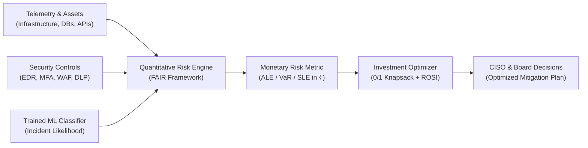
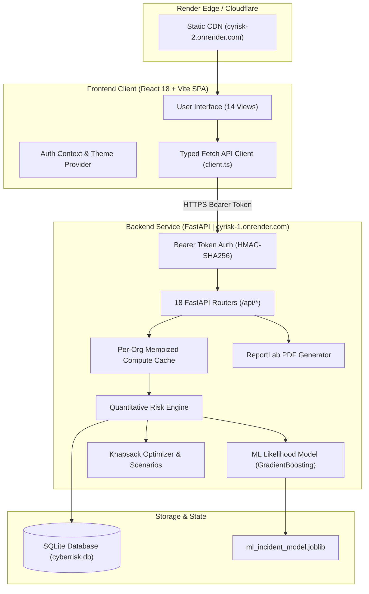

# RiskQuant — CyberRisk Quant Platform

<div align="center">

### **AI-Powered Continuous Cyber Risk Quantification & Investment Optimization Platform**

[](https://sih.gov.in/)
[](#smart-india-hackathon-2026-context)
[](#smart-india-hackathon-2026-context)
[](https://cyrisk-2.onrender.com)
[](https://fastapi.tiangolo.com/)
[](https://react.dev/)

**Translating qualitative *Low / Medium / High* cyber risk into actionable financial monetary terms (₹ INR).**  
Powered by the FAIR quantitative framework, scikit-learn machine learning, Monte Carlo loss simulations, and 0/1 knapsack budget optimization.

---

### 🚀 Live Demo
### 👉 **[https://cyrisk-2.onrender.com](https://cyrisk-2.onrender.com)**

*The platform is live and publicly accessible on Render's global CDN.*

</div>

---

## 📑 Table of Contents

- [🚀 Live Demo](#-live-demo)
- [🏆 Smart India Hackathon 2026 Context](#-smart-india-hackathon-2026-context)
- [🎯 The Problem: Why Qualitative Risk Fails](#-the-problem-why-qualitative-risk-fails)
- [💡 The RiskQuant Solution](#-the-riskquant-solution)
- [🔑 Key Highlights](#-key-highlights)
- [🏗️ System Architecture & Data Flow](#️-system-architecture--data-flow)
- [📐 Quantitative Risk Engine (FAIR Math)](#-quantitative-risk-engine-fair-math)
- [🤖 Machine Learning Likelihood Model](#-machine-learning-likelihood-model)
- [📊 Monte Carlo Value-at-Risk (VaR)](#-monte-carlo-value-at-risk-var)
- [💰 0/1 Knapsack Investment Optimizer & ROSI](#-01-knapsack-investment-optimizer--rosi)
- [🖥️ Application Features & Walkthrough](#️-application-features--walkthrough)
- [🛡️ Security Framework Mappings](#️-security-framework-mappings)
- [🔒 Multi-Tenancy & Role-Based Access Control](#-multi-tenancy--role-based-access-control)
- [💬 Deterministic Risk Assistant (NLQ)](#-deterministic-risk-assistant-nlq)
- [⚙️ Tech Stack](#️-tech-stack)
- [📂 Repository Folder Structure](#-repository-folder-structure)
- [💻 Local Installation & Setup](#-local-installation--setup)
- [🔐 Environment Variables](#-environment-variables)
- [🌐 REST API Reference](#-rest-api-reference)
- [⚖️ Integrity, Synthetic Data & Disclaimers](#️-integrity-synthetic-data--disclaimers)
- [🔮 Current Limitations & Future Roadmap](#-current-limitations--future-roadmap)
- [📄 License & Authors](#-license--authors)

---

## 🏆 Smart India Hackathon 2026 Context

| Parameter | Details |
|---|---|
| **Event** | Smart India Hackathon 2026 (SIH 2026) |
| **Organization** | AICTE Cyber Security Cell |
| **Problem Statement ID** | **SIH26105** |
| **Problem Statement Title** | AI-Powered Continuous Cyber Risk Quantification and Investment Optimization Platform |
| **Theme** | Blockchain & Cybersecurity |
| **Category** | Software |
| **Target Sector** | Enterprise IT, Banking & Financial Services (BFSI), Critical Infrastructure |

---

## 🎯 The Problem: Why Qualitative Risk Fails

For decades, cybersecurity governance has relied on subjective heatmaps labeling vulnerabilities as **"High"**, **"Medium"**, or **"Low"**. In enterprise environments, this creates critical operational disconnects:

1. **Boardroom Miscommunication:** CISOs speak in CVEs, CVSS scores, and threat indicators, while Boards and CFOs allocate budgets in **Rupees (₹)**, capital preservation, and return on investment.
2. **Alert Fatigue & Misplaced Priorities:** An organization with 500 "High" vulnerabilities cannot remediate everything at once. Treating a high vulnerability on an internal documentation server the same as one on a core payment gateway wastes limited security budgets.
3. **Budget Blind Spots:** Security investments are frequently treated as sunk costs rather than strategic capital allocations because CISOs cannot objectively calculate the **Return on Security Investment (ROSI)**.
4. **Static Point-in-Time Audits:** Risk assessments conducted annually become obsolete the moment new telemetry arrives or novel vulnerabilities are published.

---

## 💡 The RiskQuant Solution

**RiskQuant** transforms qualitative risk data into defensible **monetary terms (₹ INR)** by unifying:
- **Business Asset Criticality** (revenue impact/day, data sensitivity, operations, regulatory weight)
- **Vulnerability Exposure & Active Threats** (CVSS, exploits, patch latency, threat pressure)
- **Measured Control Effectiveness** (coverage, configuration strength, historical incident dampening)
- **Trained Machine Learning Likelihood Models** (scikit-learn gradient boosting)
- **Algorithmic Capital Optimization** (0/1 knapsack dynamic programming under ₹ budget constraints)



---

## 🔑 Key Highlights

- 💵 **Authentic Financial Translation:** Estimates **Single Loss Expectancy (SLE)**, **Annual Rate of Occurrence (ARO)**, and **Annualized Loss Expectancy (ALE)** in ₹ INR per finding and aggregates to total enterprise risk.
- 🎲 **5,000-Iteration Monte Carlo Simulation:** Computes **Value-at-Risk (VaR₉₅ and VaR₉₉)** using coupled Poisson and Lognormal loss distributions to quantify extreme tail-risk years.
- 🤖 **Transparent Hybrid Machine Learning:** Uses a deterministic scikit-learn `GradientBoostingClassifier` (180 trees, fixed seed `26105`) that nudges likelihood probabilities without fabricating financial numbers.
- 🎒 **0/1 Knapsack Portfolio Optimizer:** Solves budget-constrained control selection and **jointly re-simulates** chosen controls to account for non-additive defense-in-depth reductions.
- 🔄 **Real-Time Continuous Telemetry:** Simulated telemetry connectors update posture in near-real-time and trigger instantaneous recalculation across all open dashboard views.
- 📜 **Assessment Framework Cross-Walking:** Real-time assessment mapping against **ISO/IEC 27001**, **NIST CSF**, **CIS Controls v8**, **RBI CSF**, and **SEBI CSCRF**.
- 📑 **Evidence-Grade Reporting:** Generates downloadable multi-page executive PDF reports (via ReportLab) and comprehensive JSON audit exports from live computation.
- 🛡️ **Role-Aware Security:** Three role levels (**Executive**, **CISO**, **Analyst**) with strict tenant data isolation enforced server-side.

---

## 🏗️ System Architecture & Data Flow

RiskQuant is built as a modular monorepo featuring a high-performance Python FastAPI risk computation backend and a React 18 TypeScript Single Page Application (SPA).



### Request Lifecycle
1. The client sends authenticated requests with a bearer token in the `Authorization: Bearer <token>` header.
2. The server decodes the token using HMAC-SHA256 and retrieves the user's organization (`org_id`).
3. Tenant isolation is enforced: `current_org` derives tenant identity **strictly from the authenticated user record**, preventing cross-tenant access.
4. If cached computation is available, the endpoint returns immediately; otherwise, it builds domain state from SQLite, runs the risk engine, and caches the result.

---

## 📐 Quantitative Risk Engine (FAIR Math)

Every rupee figure in RiskQuant is derived mathematically using the **Factor Analysis of Information Risk (FAIR)** standard. No figure is hardcoded.

```
┌─────────────────────────────────────────────────────────────┐
│       Annualized Loss Expectancy (ALE) = SLE × ARO          │
└─────────────────────────────────────────────────────────────┘
```

### 1. Single Loss Expectancy (SLE)
Calculated per finding as the sum of six distinct impact components scaled by asset criticality:

$$\text{SLE} = \sum (\text{Asset Business Impact} + \text{Downtime Cost} + \text{Data Breach Cost} + \text{Incident Response} + \text{Regulatory Fines} + \text{Reputational Damage})$$

- **Asset Business Impact:** $\text{Asset Business Value} \times \min(0.95, \text{Exposure Factor})$
- **Downtime Cost:** $\text{Revenue Per Day} \times \text{Severity Downtime Days}$
- **Data Breach Cost:** $\text{Records Count} \times \text{Cost Per Record} \times \frac{\text{Sensitivity Score}}{5} \times \text{Severity Factor}$
- **Severity Factor ($\text{sf}$):** Critical ($1.00$), High ($0.75$), Medium ($0.45$), Low ($0.20$)

### 2. Annual Rate of Occurrence (ARO)
Incident frequency is derived from vulnerability attributes, environmental exposure, control effectiveness, and machine learning:

$$\text{Base Frequency} = \text{Severity Base} \times \text{CVSS Multiplier} \times \text{Exposure Multipliers} \times \text{Threat Pressure}$$

$$\text{Control Reduction} = 1 - (0.85 \times \text{Control Effectiveness})$$

$$\text{ARO} = \text{Base Frequency} \times \text{Control Reduction} \times (0.70 + 0.60 \times \text{ML Probability})$$

$$\text{Annualized Likelihood} = 1 - e^{-\text{ARO}}$$

### 3. Enterprise Risk Score (0–100)
A holistic enterprise health index blending financial loss, control posture, and vulnerability severity:

$$\text{Risk Score} = 0.75 \times \text{ALE Saturation} + 0.15 \times \text{Control Weakness} + 0.10 \times \text{Critical Vulnerability Ratio}$$

| Score Range | Risk Band | Recommended Action |
|---|---|---|
| **75 – 100** | 🔴 **Critical** | Immediate executive escalation and capital intervention |
| **50 – 74** | 🟠 **High** | Targeted control upgrades within current operating cycle |
| **25 – 49** | 🟡 **Medium** | Proactive remediation and regular monitoring |
| **0 – 24** | 🟢 **Low** | Routine posture maintenance and automated patch hygiene |

---

## 🤖 Machine Learning Likelihood Model

RiskQuant implements a genuine, reproducible machine learning model to estimate incident likelihood:

- **Algorithm:** `scikit-learn.ensemble.GradientBoostingClassifier`
- **Architecture:** 180 estimators, maximum tree depth 3, learning rate 0.08
- **Reproducibility:** Seeded with `random_state=26105` (matching SIH26105)
- **Model Card:** Cached in `ml_incident_model.joblib` with verified evaluation metrics:
  - **ROC-AUC:** `0.8669`
  - **Accuracy:** `79.2%`
  - **Brier Score:** `0.1453`
  - **Training Dataset:** 3,000 synthetic observations | Test Dataset: 1,000 observations

```
Feature Importance Distribution (Trained Model)
─────────────────────────────────────────────────────────────────
Average Control Effectiveness  [██████████████████████]  22.1%
Asset Criticality              [███████████████████]    19.2%
Public Exploit Available       [███████████████]        15.6%
Internet Facing                [██████████]             10.2%
Threat Actor Activity Level    [████████]                8.5%
Max Finding CVSS               [██████]                  6.4%
Critical Vulnerability Count   [██████]                  5.9%
Open Vulnerability Count       [█████]                   5.1%
Data Sensitivity Tier          [████]                    4.0%
Past Incident Count            [███]                     3.2%
─────────────────────────────────────────────────────────────────
```

> [!NOTE]
> **Model Transparency:** The ML model only predicts incident probability to refine the ARO frequency. The ML model **never invents monetary figures**. Financial numbers remain anchored to the FAIR equations and enterprise asset values.

---

## 📊 Monte Carlo Value-at-Risk (VaR)

While ALE provides expected annual loss, executive boards must plan for severe tail-risk scenarios (e.g., "What is our worst-case loss in 1 out of 20 years?").

RiskQuant executes a **5,000-iteration Monte Carlo simulation** (`VAR_SEED=26105`):
1. **Event Occurrence:** Simulated findings sample incident occurrence counts using a **Poisson process** parametrized by finding $\text{ARO}$.
2. **Loss Magnitude:** For each triggered incident, loss severity is sampled from a **Lognormal distribution** centered on the finding's $\text{SLE}$ ($\sigma = 0.50$).
3. **Enterprise Rollup:** Aggregated yearly totals yield the empirical cumulative loss distribution.
4. **Metrics Reported:**
   - **VaR₉₅ (Value-at-Risk at 95% confidence):** Loss threshold exceeded in only 1 of 20 years.
   - **VaR₉₉ (Value-at-Risk at 99% confidence):** Catastrophic 1-in-100-year loss threshold.
   - **Mean Simulated Loss & Median Loss (P50).**

---

## 💰 0/1 Knapsack Investment Optimizer & ROSI

Security teams operate under strict budgetary constraints. RiskQuant solves the capital allocation dilemma using **0/1 Knapsack Dynamic Programming**.

### The Knapsack Problem Formulation
Given a budget constraint $B$ (in ₹ Lakhs) and a set of candidate security controls $C_1, C_2, \dots, C_n$, where each control has cost $w_i$ and reduces enterprise loss by $\Delta \text{ALE}_i$:

$$\text{Maximize} \sum_{i \in S} \Delta \text{ALE}_i \quad \text{subject to} \quad \sum_{i \in S} w_i \le B$$

### Joint Re-Simulation (Non-Additive Defense-in-Depth)
Because security controls interact (e.g., implementing MFA reduces the risk that EDR would otherwise need to mitigate), simply summing individual ALE reductions leads to inflated estimates.

RiskQuant addresses this by **jointly re-simulating the entire selected portfolio**:
1. Candidate items are evaluated and chosen via dynamic programming.
2. The chosen set is applied together to a cloned domain state.
3. The engine recomputes the global risk model to report the true **Joint ALE Reduction** and **Portfolio ROSI**:

$$\text{ROSI (\%)} = \frac{\text{Joint ALE Reduction (₹)} - \text{Total Investment Cost (₹)}}{\text{Total Investment Cost (₹)}} \times 100$$

The optimizer automatically outputs an **Efficient Frontier Curve** illustrating diminishing returns on incremental security capital.

---

## 🖥️ Application Features & Walkthrough

The web application features 14 dedicated views organized into 6 functional modules:

```
┌────────────────────────────────────────────────────────────────────────┐
│                        RiskQuant Navigation Suite                      │
├──────────────┬──────────────┬──────────────┬──────────────┬────────────┤
│   Overview   │  Inventory   │  Decisions   │  Governance  │Operations  │
├──────────────┼──────────────┼──────────────┼──────────────┼────────────┤
│ • Dashboard  │ • Assets     │ • Recommend  │ • Frameworks │• Telemetry │
│ • Risk Eval  │ • Vulns      │ • Scenarios  │ • Assumptions│• Reports   │
│              │ • Controls   │ • Optimizer  │ • Assistant  │• Model Card│
└──────────────┴──────────────┴──────────────┴──────────────┴────────────┘
```

### Feature Overview

| Page | Path | Key Capabilities |
|---|---|---|
| **Executive Dashboard** | `/` | Headline ₹ ALE, Value-at-Risk, 0-100 risk score, top risk drivers, business unit breakdown, weakest controls, and trend line. |
| **Risk Analysis** | `/risk` | Full SLE → ARO → ALE mathematical derivation per finding, Monte Carlo percentile distribution, and risk contributor rankings. |
| **Asset Inventory** | `/assets` | 22 enterprise assets with business criticality scoring (0-100), financial exposure, and dependency graphs. |
| **Vulnerability Hub** | `/vulnerabilities` | Active CVE inventory with severity, exploitability flags, CVSS scores, and computed finding ALE. |
| **Security Controls** | `/controls` | Monitored security controls with measured coverage, configuration strength, and incident-dampened effectiveness scores. |
| **Recommendations** | `/recommendations` | Prioritized mitigation actions ranked by marginal ALE reduction (₹) and ROSI (%). |
| **What-if Scenarios** | `/scenarios` | Interactive simulation sandbox to model control degradation, patch deployments, or threat spikes on cloned in-memory state. |
| **Investment Optimizer** | `/optimizer` | Dynamic budget slider to compute the optimal 0/1 knapsack control portfolio and visualize the efficiency curve. |
| **Framework Mapping** | `/frameworks` | Cross-walk posture against ISO 27001, NIST CSF, CIS Controls, RBI CSF, and SEBI CSCRF. |
| **Assumptions Editor** | `/assumptions` | Edit financial drivers (cost per record, daily downtime cost, regulatory multiplier) with instant model recomputation. |
| **Risk Assistant** | `/assistant` | Natural language interface backed by a deterministic intent router that extracts answers directly from the computed model. |
| **ML Model Card** | `/model` | Machine learning transparency card featuring ROC-AUC, Brier score, hyperparameters, and feature importances. |
| **Data Sources** | `/telemetry` | Simulated SIEM, EDR, and cloud connectors with a live "Simulate Telemetry" trigger that broadcasts posture updates. |
| **Evidence Reports** | `/reports` | One-click generation of audit-ready executive PDF reports and full JSON evidence archives. |

---

## 🛡️ Security Framework Mappings

RiskQuant automatically maps technical control coverage and vulnerability findings across major international and Indian regulatory frameworks:

- 🌐 **ISO/IEC 27001:2022** — Information security management systems
- 🇺🇸 **NIST Cybersecurity Framework (CSF v2.0)** — Identify, Protect, Detect, Respond, Recover
- 🛡️ **CIS Critical Security Controls (v8)** — Prioritized cyber defense safeguards
- 🏦 **Reserve Bank of India (RBI) Cyber Security Framework** — BFSI mandate for scheduled banks
- 📈 **SEBI Cybersecurity and Cyber Resilience Framework (CSCRF)** — Capital markets and intermediaries

> [!IMPORTANT]
> **Assessment Language Only:** Framework mapping is an objective posture assessment tool. It reflects calculated control coverage and gap identification; it does not constitute formal certification or regulatory audit sign-off.

---

## 🔒 Multi-Tenancy & Role-Based Access Control

The platform enforces multi-tenant isolation where each enterprise organization operates within an isolated data boundary.

### Role Permissions Matrix

| Feature / Action | Executive (`exec`) | CISO (`ciso`) | Analyst (`analyst`) |
|---|:---:|:---:|:---:|
| View Dashboard & Reports | ✅ Read-only | ✅ Full | ✅ Full |
| View Risk, Assets, Vulns & Controls | ✅ Read-only | ✅ Full | ✅ Full |
| Run What-if Scenarios | ✅ Read-only | ✅ Full | ✅ Full |
| Run Investment Optimizer | ✅ Read-only | ✅ Full | ✅ Full |
| Simulate Telemetry | ❌ Forbidden (403) | ✅ Allowed | ✅ Allowed |
| Edit Financial Assumptions | ❌ Forbidden (403) | ✅ Allowed | ✅ Allowed |
| Generate & Download PDF Reports | ✅ Allowed | ✅ Allowed | ✅ Allowed |
| Import Assets / Vulnerabilities | ❌ Forbidden (403) | ✅ Allowed | ✅ Allowed |

### Demo Accounts

The deployed environment includes pre-seeded demo accounts for **Meghdoot Financial Services Ltd**:

| Role | Username | Password | Access Description |
|---|---|---|---|
| **Executive** | `exec` | `exec123` | Read-only board view; writes return 403 |
| **CISO** | `ciso` | `ciso123` | Full access, scenario simulation & mutation |
| **Analyst** | `analyst` | `analyst123` | Full technical analysis & telemetry testing |

---

## 💬 Deterministic Risk Assistant (NLQ)

RiskQuant includes an intelligent natural language assistant to query the risk engine in plain English (e.g., *"What is our expected annual loss?"*, *"Which assets drive the most risk?"*, *"How much does upgrading EDR reduce our ALE?"*).

### Safeguard Against Hallucinations
- The assistant is powered by a **deterministic semantic intent router** (`engine/nlq.py`).
- Every figure returned is extracted directly from the computed risk model in memory.
- If an optional LLM is enabled (`LLM_ENABLED=true`), the LLM is restricted to **rephrasing** the deterministic data. It is never permitted to generate or guess numerical outputs.

---

## ⚙️ Tech Stack

### Backend
- **Core Framework:** Python 3.14 · FastAPI 0.141 · Starlette · Uvicorn
- **ORM & Database:** SQLAlchemy 2.1 · SQLite (embedded, zero external setup)
- **Data Science & ML:** NumPy 2.5 · Pandas 3.0 · SciPy 1.18 · scikit-learn 1.9.1 · Joblib
- **Reporting Engine:** ReportLab 5.0 (PDF generation) · PyYAML
- **Security & Validation:** Pydantic v2.13 · PBKDF2 hashing · HMAC-SHA256 bearer tokens
- **Testing:** Pytest 9.1 · HTTPX

### Frontend
- **Framework & Build:** React 18.3 · TypeScript 5.6 (strict mode) · Vite 5.4
- **Styling & Theming:** Tailwind CSS 3.4 · CSS Semantic Variable Tokens (Day/Night modes)
- **Data Visualization:** Recharts 2.12 (dynamic theme-aware charts) · Lucide React 0.451
- **Routing & Networking:** React Router DOM 6.26 · Fetch API with typed client wrappers

---

## 📂 Repository Folder Structure

```
CyRISK/
├── backend/                        # FastAPI service & quantitative risk engine
│   ├── app/
│   │   ├── engine/                 # Core mathematical & analytical models
│   │   │   ├── risk_engine.py      # Master compute pipeline (ALE, VaR, score)
│   │   │   ├── financial.py        # SLE / ARO / ALE equations
│   │   │   ├── criticality.py      # Asset criticality scoring (0–100)
│   │   │   ├── controls.py         # Control effectiveness & dampening
│   │   │   ├── ml_model.py         # scikit-learn GradientBoosting likelihood model
│   │   │   ├── optimizer.py        # 0/1 knapsack dynamic programming & ROSI
│   │   │   ├── scenarios.py        # What-if mutation sandbox on cloned state
│   │   │   ├── frameworks_data.py  # ISO, NIST, CIS, RBI, SEBI assessment rules
│   │   │   ├── nlq.py              # Deterministic natural language query parser
│   │   │   ├── reports.py          # ReportLab PDF & JSON report generator
│   │   │   └── snapshots.py        # Historical risk telemetry snapshot logger
│   │   ├── models/                 # SQLAlchemy ORM schemas
│   │   │   ├── core.py             # Organizations, assets, business units
│   │   │   ├── security.py         # Vulnerabilities, controls, incidents, threats
│   │   │   ├── risk.py             # Assumptions, findings, risk snapshots
│   │   │   ├── decisions.py        # Investment options, recommendations, scenarios
│   │   │   ├── frameworks.py       # Global framework catalogs & mappings
│   │   │   └── users.py            # User authentication records & roles
│   │   ├── routers/                # 18 modular API route controllers
│   │   ├── seed/                   # First-run demo enterprise seeder ("Meghdoot")
│   │   ├── auth.py                 # HMAC token generation & PBKDF2 verification
│   │   ├── config.py               # Environment configuration & CORS setup
│   │   ├── database.py             # Database engine & session maker
│   │   ├── deps.py                 # Dependency injection & memoized cache
│   │   └── main.py                 # FastAPI application factory & lifespan
│   ├── tests/                      # Pytest suite (engine math, contracts, isolation)
│   └── requirements.txt            # Pinned backend dependencies
│
├── frontend/                       # React 18 TypeScript Single Page Application
│   ├── public/                     # Static assets & RiskQuant logo
│   ├── src/
│   │   ├── api/                    # Typed API client & response interfaces
│   │   ├── auth/                   # Authentication context & route guards
│   │   ├── components/             # UI kit, layout shell, data tables, modals, charts
│   │   ├── lib/                    # INR currency formatters & useApi hook
│   │   ├── pages/                  # 14 application views (Dashboard, Risk, etc.)
│   │   ├── theme/                  # ThemeContext (Day / Night mode switching)
│   │   ├── App.tsx                 # Route declarations & shell layout
│   │   └── main.tsx                # React DOM mount point
│   ├── package.json                # Frontend package dependencies
│   ├── tailwind.config.js          # Tailwind CSS styling configuration
│   └── vite.config.ts              # Vite dev server & proxy configuration
│
├── docs/                           # Architecture specs, conventions, and runbooks
└── sample_data/                    # Sample CSV/JSON imports for assets & vulnerabilities
```

---

## 💻 Local Installation & Setup

### Prerequisites
- **Python:** 3.11+ (Python 3.14 tested and supported)
- **Node.js:** 18.0+
- **Git**

### 1. Clone the Repository
```bash
git clone https://github.com/vinitkumarpatil/CyRISK.git
cd CyRISK
```

### 2. Backend Setup
```bash
cd backend
python -m venv .venv

# On Windows:
.venv\Scripts\activate
# On macOS / Linux:
source .venv/bin/activate

pip install -r requirements.txt
cp .env.example .env
```
Start the backend API server:
```bash
uvicorn app.main:app --reload --port 8000
```
*The database (`backend/cyberrisk.db`) will auto-initialize and seed the demo enterprise automatically on first launch.*  
- Backend API Docs (Swagger): `http://127.0.0.1:8000/docs`
- Health Endpoint: `http://127.0.0.1:8000/api/health`

### 3. Frontend Setup
In a new terminal window:
```bash
cd frontend
npm install
npm run dev
```
Open your browser at **`http://localhost:5173`**. The Vite development server automatically proxies API requests to `http://127.0.0.1:8000`.

### 4. Running Verification Tests
```bash
# Backend pytest suite (37/37 tests covering FAIR math, contracts, and tenant isolation):
cd backend && pytest -q

# Frontend TypeScript check and production build:
cd frontend && npm run typecheck && npm run build
```

---

## 🔐 Environment Variables

### Backend Configuration (`backend/.env`)

| Variable | Default Value | Description |
|---|---|---|
| `APP_ENV` | `development` | Deployment environment (`development` or `production`). |
| `DATABASE_URL` | `sqlite:///./cyberrisk.db` | SQLAlchemy connection string. Defaults to embedded SQLite. |
| `SECRET_KEY` | *(Set a random 32+ char key)* | Secret string used for signing authentication tokens. |
| `TOKEN_TTL_HOURS` | `12` | Token expiration duration in hours. |
| `CORS_ORIGINS` | `http://localhost:5173,...` | Comma-separated list of allowed origins. |
| `LLM_ENABLED` | `false` | Whether to enable LLM rephrasing for the assistant. |
| `LLM_API_KEY` | `""` | Optional API key for LLM provider (when enabled). |
| `MAX_UPLOAD_BYTES` | `10485760` | Maximum asset/vulnerability upload size in bytes (10 MB). |

### Frontend Configuration (`frontend/.env`)

| Variable | Default Value | Description |
|---|---|---|
| `VITE_API_BASE` | `""` (blank in dev) | Base URL of the backend API. In production, set to `https://cyrisk-1.onrender.com`. |

---

## 🌐 REST API Reference

The backend exposes 18 modular API routers under the `/api` prefix:

```
Authentication & Tenant Management
  POST /api/auth/login                  Sign in and receive bearer token
  POST /api/auth/register               Register new enterprise organization & admin
  GET  /api/auth/me                     Retrieve current authenticated user payload
  GET  /api/auth/demo-users             Public listing of pre-configured demo logins

Risk Engine & Computation
  GET  /api/dashboard                   Consolidated executive dashboard rollup
  GET  /api/risk                        Complete quantitative risk computation
  GET  /api/risk/findings               Granular findings with full SLE/ARO/ALE breakdown
  GET  /api/risk/contributors           Top risk drivers ranked by financial impact
  GET  /api/risk/snapshots              Historical risk scores and telemetry trends

Asset & Vulnerability Inventory
  GET  /api/assets                      List enterprise assets with criticality scores
  POST /api/assets                      Add new asset (CISO / Analyst only)
  GET  /api/vulnerabilities             List vulnerabilities with CVSS & exposure metrics
  GET  /api/controls                    List security controls with effectiveness scores

Decision Science & Optimization
  POST /api/scenarios/investment        Simulate what-if changes on cloned state
  POST /api/optimizer/run               Run 0/1 knapsack budget optimizer under ₹ limit
  GET  /api/recommendations             Prioritized mitigations ranked by ROSI

Intelligence & Operations
  POST /api/assistant/query             Query deterministic risk assistant in natural language
  GET  /api/model                       Retrieve ML model card, metrics & feature weights
  GET  /api/frameworks                  Retrieve compliance framework coverage scores
  POST /api/demo/simulate-telemetry     Trigger live telemetry event and recompute model
  POST /api/reports/generate            Generate audit PDF report or JSON payload
  GET  /api/reports/{id}/download       Download rendered report file
```

---

## ⚖️ Integrity, Synthetic Data & Disclaimers

> [!CAUTION]
> **Synthetic Demonstration Data:**
> All entities, vulnerabilities, financial figures, incident histories, and business units belonging to **"Meghdoot Financial Services Ltd"** are completely synthetic and engineered for demonstration and evaluation purposes.
>
> **Model-Driven Estimates:**
> All calculated financial values (SLE, ARO, ALE, VaR, and ROSI) represent statistical model estimates derived from the input assumptions and telemetry. They do not constitute guaranteed predictions of real-world losses or savings.
>
> **Regulatory Disclaimer:**
> Framework assessment indices (ISO 27001, NIST CSF, CIS Controls, RBI, SEBI) serve as diagnostic aids and do not constitute legal or regulatory certification.

---

## 🔮 Current Limitations & Future Roadmap

### Current Limitations
- **Ephemeral Storage on Free Tier:** On Render's free tier, the SQLite database resets on cold starts. However, the system is designed to be self-healing—automatically reseeding the complete demo dataset on boot.
- **Simulated Telemetry:** Security event telemetry is simulated within the application rather than ingested from live enterprise SIEM/EDR instances.

### Future Roadmap
- 🔌 **Enterprise Connectors:** Native ingestion pipelines for Splunk, Microsoft Sentinel, CrowdStrike Falcon, and AWS Security Hub.
- 🐘 **PostgreSQL & Time-Series Engine:** Transition persistence to TimescaleDB / PostgreSQL for multi-year historical risk trending.
- 🎲 **Advanced Parametric Loss Distributions:** Allow risk engineers to toggle between Lognormal, Beta-PERT, and Weibull distributions for Monte Carlo simulations.
- 🤝 **Automated Remediation Webhooks:** Trigger automated Jira tickets, ServiceNow changes, and Terraform policy updates directly from optimizer selections.

---

## 📄 License & Authors

This project is developed for the **Smart India Hackathon 2026 (SIH 2026)** under Problem Statement **SIH26105**.

- **Author / Lead Developer:** Vinit Kumar Patil ([@vinitkumarpatil](https://github.com/vinitkumarpatil))
- **Repository:** [https://github.com/vinitkumarpatil/CyRISK](https://github.com/vinitkumarpatil/CyRISK)
- **Live Application:** [https://cyrisk-2.onrender.com](https://cyrisk-2.onrender.com)
- **License:** Open for evaluation under the terms of the Smart India Hackathon 2026.

---

<div align="center">

**RiskQuant — Translating Cybersecurity Risk into Business Decisions**  
*Built with precision for SIH 2026*

</div>
